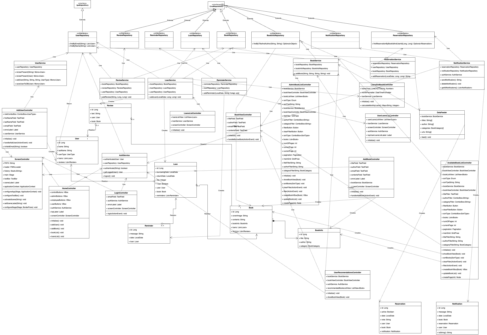
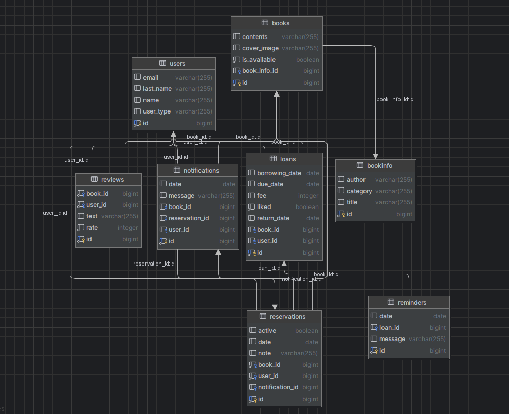

# Galernicy - Czytelnia
## Skład grupy
- [x] **Aleksandra Makara**
- [x] **Izabella Rosikoń**
- [x] **Radosław Niżnik**
- [x] **Piotr Śliperski**

## Przykładowe widoki
### Ekran startowy

### Panel wypożyczeń pracownika

### Lista dostępnych książek

## Szkielet aplikacji

Aplikacja wykonana jest przy użyciu Springa i JavyFX. Do komunikacji z bazą danych wykorzystywany jest Hibernate.
Aplikacja jest podzielona na 3 warstwy: warstwę prezentacji, warstwę logiki biznesowej oraz warstwę dostępu do danych.

## Diagram UML

## Schemat bazy danych

### Opis tabel
- **User** - tabela przechowująca dane użytkowników, zawiera również informację o typie użytkownika
- **UserType** - tabela przechowująca typy użytkowników (zdefiniowane w pliku `UserType.java` )
- **Book** - tabela reprezentująca pojedyńczy egzemplarz książki
- **BookInfo** - tabela przechowująca informacje o książkach, które są wspólne dla wszystkich egzemplarzy
- **Loan** - tabela przechowująca informacje o wypożyczeniach
- **Reminder** - tabela przechowująca informacje o przypomnieniach
- **Review** - tabela przechowująca informacje o recenzjach

## Działanie aplikacji

W pliku `JkSr0940GalernicyApplication.java` znajduje się metoda `main`, która uruchamia aplikację JavaFX.
Z kolei w pliku `CzytelniaApplication.java` znajduje się metoda `init`, która uruchamia aplikację Springa.
Jest to odpowiednie miejsce na uruchomienie Springa, gdyż metoda `init` nie jest wywoływana na wątku graficznym JavaFX, ale 
na wątku inicjalizacyjnym. Dzięki temu nie blokujemy wątku graficznego, a aplikacja nie zawiesza się podczas uruchamiania.

### Warstwa prezentacji

W warstwie prezentacji posługujemy się wzorcem projektowym Model-View_Controller (MVC). W pakiecie `controller`znajdują się
kontrolery, które są odpowiedzialne za obsługę widoków. W obecnym stanie aplikacji jest tam tylko jeden kontroler - `AddUserController`, 
który jest odpowiedzialny za obsługę widoku dodawania użytkownika, w tym sprawdzenie poprawności wprowadzonych danych,
oraz to czy użytkownik nie powtarza się. Dodatkowo kontroler ten jest odpowiedzialny za dodawanie logów za co odpowiada 
adnotacja '@Slf4j'. Dodane zostało kilka nowych kontrolerów, każdy z nich jest odpowiedzialny za inny widok.
Lista kontrolerów:
- `AddBookController` - kontroler odpowiedzialny za obsługę widoku dodawania książki
- `AddUserController` - kontroler odpowiedzialny za obsługę widoku dodawania użytkownika
- `AdminBookListController` - kontroler odpowiedzialny za obsługę widoku listy książek dla administratora
- `BookViewController` - kontroler odpowiedzialny za obsługę widoku pojedynczej książki oraz jej wypożyczenie
- `HomeController` - kontroler odpowiedzialny za obsługę panelu wyboru akcji dla użytkownika
- `LoginController` - kontroler odpowiedzialny za obsługę widoku logowania
- `ScreenController` - kontroler odpowiedzialny za obsługę widoku głównego, a więc paska górnego, oraz wczytywanie
odpowiednich widoków.
- `UserRecommendationsController` - kontroler odpowiedzialny za obsługę widoku rekomendacji dla użytkownika
- `UserLoansListController` - kontroler odpowiedzialny za obsługę widoku listy wypożyczeń dla pojedynczego użytkownika
- `NotificationController` - kontroler odpowiedzialny za obsługę widoku powiadomień dla użytkownika

### Warstwa logiki biznesowej

W warstwie logiki biznesowej znajdują się serwisy, które są odpowiedzialne za przetwarzanie danych. Zdefiniowane są one w 
pakiecie `service`. Serwisy zawierają adnotację `@Service`, dzięki czemu Spring automatycznie tworzy obiekty tych klas i
wstrzykuje je w odpowiednie miejsca. W warstwie prezentacji serwisy są wstrzykiwane do kontrolerów. Serwisy posiadają również 
wstrzykniętą zależność do repozytoriów, dzięki czemu mogą pobierać dane z bazy danych.

- **UserService** - serwis odpowiedzialny za obsługę użytkowników. Zawiera metody do dodawania, oraz pobierania użytkowników z bazy danych.
- **BookService** - serwis odpowiedzialny za obsługę książek. Zawiera metody do dodawania, oraz pobierania książek z bazy danych.
- **LoanService** - serwis odpowiedzialny za obsługę wypożyczeń. Zawiera metody do dodawania, oraz pobierania wypożyczeń z bazy danych.
- **ReminderService** - serwis odpowiedzialny za obsługę przypomnień. Zawiera metody do dodawania przypomnień z bazy danych.
- **ReviewService** - serwis odpowiedzialny za obsługę recenzji. Zawiera metody do dodawania recenzji z bazy danych.
- **NotificationService** - serwis odpowiedzialny za obsługę powiadomień. Zawiera metody do dodawania powiadomień z bazy danych.

### Warstwa dostępu do danych

W warstwie dostępu do danych znajdują się repozytoria, które są odpowiedzialne za komunikację z bazą danych. Zdefiniowane są one w
pakiecie `repository`. Repozytoria zawierają adnotację `@Repository`, dzięki czemu Spring automatycznie tworzy obiekty tych klas i
wstrzykuje je w odpowiednie miejsca. W warstwie logiki biznesowej repozytoria są wstrzykiwane do serwisów. Repozytoria implementują 
intefejsy `CrudRepository` lub `JpaRepository`, które są częścią Spring Data. Dzięki temu repozytoria posiadają wiele gotowych metod,
które pozwalają na wykonywanie operacji na bazie danych.

Ponadto w pakiecie `model` znajdują się klasy reprezentujące encje z bazy danych. Klasy te posiadają adnotację `@Entity`, dzięki czemu
Spring automatycznie tworzy tabele w bazie danych na podstawie tych klas. W klasach tych znajdują się również pola z adnotacjami `@Id` oraz `@GeneratedValue`,
dzięki czemu Spring automatycznie generuje klucze główne dla tabel. W klasach tych znajdują się również pola z adnotacją `@ManyToOne` oraz `@OneToMany`,
dzięki czemu Spring automatycznie tworzy relacje między tabelami.

## Aktualizacja M2

### Nawigacja po aplikacji

W aplikacji została dodana nawigacja po aplikacji. 
W tym celu został utworzony kontroler `ScreenController`, który jest odpowiedzialny za przejścia między widokami
oraz obsługę paska górnego i historii. Historia jest przechowywana na stosie, dzięki czemu użytkownik może 
wrócić do poprzedniego widoku. Stos ma minimalny rozmiar 1, dzięki czemu użytkownik nie może wrócić do widoku logowania.
Żeby przełączyć konto należy wybrać opcję "Wyloguj" z menu i zalogować się na inne konto.

Klasa `ScreenController` posiada metodę `setSceneLabel`, dzięki której możemy zmieniać tekst w pasku górnym z dowolnego innego widoku.

### Logowanie i rozróżnianie użytkowników

Dodała zostana również funkcjonalność logowania. Polega ona na wpisaniu adresu email. Jeśli adres email znajduje się w bazie danych,
użytkownik zostaje zalogowany. W przeciwnym wypadku zostaje wyświetlony komunikat o błędzie. Informacja o obecnie zalogowanym 
użytkowniku jest przechowywana w klasie `AuthService` (singleton), która jest wstrzykiwana do kontrolerów. '

### System rekomendacji

System rekomendacji działa na podstawie dotychczasowych wypożyczeń użytkownika. Na ich podstawie wybieramy najczęstszą kategorię książek,
a następnie wybieramy 3 najczęściej wypożyczane książki z tej kategorii.
